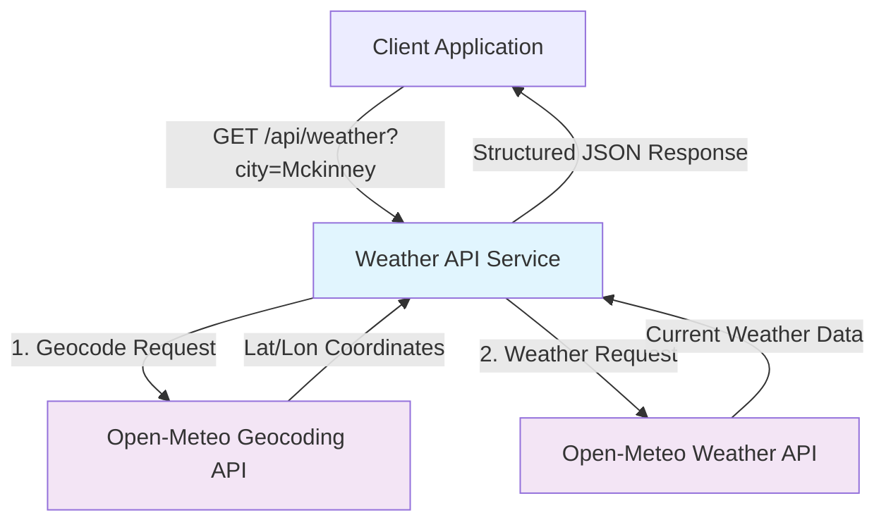

# Weather API Integration Service

[](https://www.mulesoft.com/)
[](https://openjdk.java.net/)
[]()

A production-ready weather API integration service built with MuleSoft that provides current weather information for any city worldwide. This service demonstrates enterprise integration patterns, external API orchestration, and data transformation capabilities.

## Quick Start (30 seconds to running)

```bash
# Clone and navigate to project
cd logananks-weather-hello-08-24-2025

# Deploy to local Mule runtime (if you have MuleSoft installed)
mvn clean package
# The deployable JAR is: target/logananks-weather-hello-08-24-2025-1.0.0-SNAPSHOT-mule-application.jar

# Test the API
curl "http://localhost:8081/api/weather?city=Mckinney"
```

**Expected Response:**
```json
{
  "city": "McKinney",
  "latitude": 33.19762,
  "longitude": -96.61527,
  "temperature_c": 26.2,
  "windspeed_kmh": 10.3,
  "winddirection_deg": 29,
  "observed_at_iso": "2025-08-24T13:45"
}
```

## What This Does

This service transforms a simple city name into comprehensive current weather data by:

1. **Accepting REST requests** at `/api/weather` with optional city parameter
2. **Geocoding city names** to precise coordinates using Open-Meteo's geocoding service
3. **Fetching real-time weather** from Open-Meteo's weather API
4. **Transforming and enriching** the response with clean, structured data
5. **Returning standardized JSON** with current weather conditions

**Business Value:**
- Enables applications to integrate weather data without managing multiple API keys
- Provides consistent data format regardless of underlying weather service changes
- Includes intelligent defaults (falls back to Dallas if no city specified)
- Production-ready with proper error handling and logging

## Architecture Overview



**Key Components:**
- **HTTP Listener** - RESTful API endpoint on port 8081
- **Geocoding Integration** - Converts city names to coordinates
- **Weather Data Integration** - Fetches current weather conditions
- **DataWeave Transformations** - Data mapping and response formatting
- **Error Handling** - Graceful fallbacks and default values

## API Documentation

### Primary Endpoint

**GET** `/api/weather`

**Query Parameters:**
- `city` (optional) - City name to get weather for (defaults to "Dallas")

**Response Format:**
```json
{
  "city": "string",
  "latitude": "number",
  "longitude": "number", 
  "temperature_c": "number",
  "windspeed_kmh": "number",
  "winddirection_deg": "number",
  "observed_at_iso": "string (ISO datetime)"
}
```

**Example Requests:**
```bash
# Default city (Dallas)
curl "http://localhost:8081/api/weather"

# Specific city
curl "http://localhost:8081/api/weather?city=London"

# City with spaces
curl "http://localhost:8081/api/weather?city=New%20York"
```

For complete API documentation with error scenarios and additional examples, see [API_DOCUMENTATION.md](./API_DOCUMENTATION.md).

## Development Setup

### Prerequisites
- **Java 17** or higher
- **Maven 3.6+** 
- **MuleSoft Anypoint Studio** (recommended) or **Mule Runtime 4.9.0**

### Local Development
```bash
# Clone the repository
git clone <repository-url>
cd logananks-weather-hello-08-24-2025

# Build the project
mvn clean compile

# Run tests (when implemented)
mvn test

# Package for deployment
mvn clean package
```

### IDE Setup
1. Import as Maven project in Anypoint Studio
2. The main flow is in `src/main/mule/logananks-weather-hello-08-24-2025.xml`
3. Configuration files are in `src/main/resources/`

## Production Deployment

### Deployment Options
1. **Anypoint Platform** - Cloud deployment with full monitoring
2. **On-Premises Mule Runtime** - Enterprise server deployment
3. **CloudHub** - Managed cloud service
4. **Hybrid Deployment** - Mix of cloud and on-premises

### Configuration Management
- **Environment Variables** - For API endpoints and configuration
- **Property Files** - For environment-specific settings
- **Security** - No API keys required (using free Open-Meteo APIs)

### Monitoring & Health Checks
- **Application Logs** - Configured in `src/main/resources/log4j2.xml`
- **Health Endpoint** - Built-in Mule runtime health checks
- **Custom Monitoring** - Can be extended with Anypoint Monitoring

For detailed deployment instructions, see [DEPLOYMENT_GUIDE.md](./DEPLOYMENT_GUIDE.md).

## Technical Deep Dive

### Integration Patterns Used
- **API Gateway Pattern** - Single entry point for weather data
- **Service Orchestration** - Coordinating multiple external services
- **Data Transformation** - Converting between different data formats
- **Circuit Breaker** - Implicit through MuleSoft's error handling

### Key Technical Decisions
- **Open-Meteo APIs** - Chosen for reliability, no API key requirement, and comprehensive data
- **Synchronous Processing** - Real-time responses for better user experience  
- **DataWeave 2.0** - Powerful data transformation capabilities
- **RESTful Design** - Standard HTTP methods and status codes

For complete technical architecture analysis, see [TECHNICAL_ARCHITECTURE.md](./TECHNICAL_ARCHITECTURE.md).

## Project Structure

```
logananks-weather-hello-08-24-2025/
├── README.md                          # This file
├── API_DOCUMENTATION.md               # Complete API reference
├── TECHNICAL_ARCHITECTURE.md          # Design decisions and patterns
├── DEPLOYMENT_GUIDE.md               # Operations and deployment
├── pom.xml                           # Maven configuration
├── mule-artifact.json                # Mule application metadata
├── src/
│   ├── main/
│   │   ├── mule/
│   │   │   └── logananks-weather-hello-08-24-2025.xml  # Main flow
│   │   └── resources/
│   │       ├── application-types.xml  # DataWeave type definitions
│   │       └── log4j2.xml            # Logging configuration
│   └── test/
│       └── munit/                    # Test structure (ready for implementation)
└── target/
    └── logananks-weather-hello-08-24-2025-1.0.0-SNAPSHOT-mule-application.jar
```

## Testing the Service

### Manual Testing
```bash
# Test default behavior
curl "http://localhost:8081/api/weather"

# Test with various cities
curl "http://localhost:8081/api/weather?city=Tokyo"
curl "http://localhost:8081/api/weather?city=São%20Paulo"
curl "http://localhost:8081/api/weather?city=Sydney"

# Test edge cases
curl "http://localhost:8081/api/weather?city="           # Should default to Dallas
curl "http://localhost:8081/api/weather?city=InvalidCity" # Should handle gracefully
```

### Automated Testing
The project structure includes MUnit test framework setup. Future enhancements could include:
- Unit tests for DataWeave transformations
- Integration tests for external API calls
- Performance tests for load scenarios

## Future Enhancements

### Immediate Opportunities
- **Caching Layer** - Redis/Hazelcast for frequently requested cities
- **Rate Limiting** - Protect against excessive API usage
- **Enhanced Error Handling** - More granular error responses
- **API Documentation** - Swagger/OpenAPI specification

### Strategic Enhancements  
- **Multi-day Forecasts** - Extend beyond current weather
- **Weather Alerts** - Integration with weather warning systems
- **Historical Data** - Archive and trend analysis capabilities
- **Microservices Architecture** - Break into focused services

## Contributing

This project demonstrates enterprise integration patterns and MuleSoft best practices. Key areas for contribution:
- Test coverage expansion
- Additional weather data sources
- Performance optimization
- Documentation improvements

## License

This project is intended for demonstration and educational purposes.

---

**Built with ❤️ using MuleSoft 4.9.0 | Demonstrates rapid integration development and production-ready practices**
