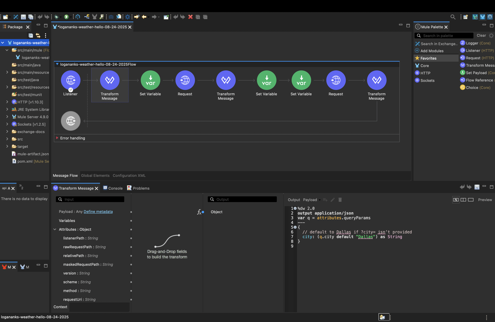
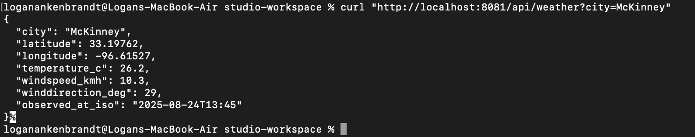
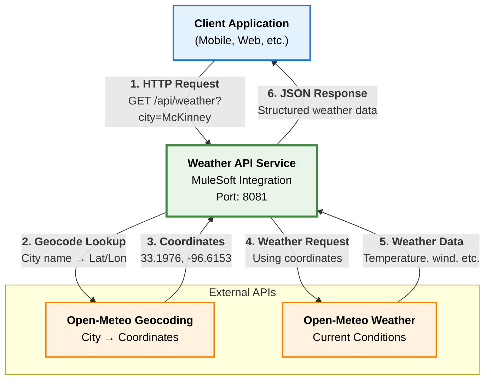

# Weather API Integration Service

Weather API service that returns current weather data for cities. Uses MuleSoft to integrate Open-Meteo APIs.




## Setup

```bash
# Clone and navigate to project
cd logananks-weather-hello-08-24-2025

# Deploy to local Mule runtime (if you have MuleSoft installed)
mvn clean package

# Test the API
curl "http://localhost:8081/api/weather?city=Mckinney"
```

Response:
```json
{
  "city": "McKinney",
  "latitude": 33.19762,
  "longitude": -96.61527,
  "temperature_c": 26.2,
  "windspeed_kmh": 10.3,
  "winddirection_deg": 29,
  "observed_at_iso": "2025-08-24T13:45"
}
```

## Function

Converts city names to weather data:

1. Receives HTTP requests at `/api/weather?city=name`
2. Geocodes city name to coordinates via Open-Meteo
3. Fetches weather data using coordinates via Open-Meteo  
4. Returns JSON weather response

## Architecture Overview



Components:
- HTTP Listener on port 8081
- Geocoding via Open-Meteo API
- Weather data via Open-Meteo API  
- DataWeave transformations
- Error handling with Dallas fallback

## API

GET `/api/weather`

Parameters:
- `city` (optional) - Defaults to "Dallas"

Response:
```json
{
  "city": "string",
  "latitude": "number",
  "longitude": "number", 
  "temperature_c": "number",
  "windspeed_kmh": "number",
  "winddirection_deg": "number",
  "observed_at_iso": "string (ISO datetime)"
}
```
## Development

Prerequisites:
- Java 17+
- Maven 3.6+
- MuleSoft Anypoint Studio or Mule Runtime 4.9.0

Build:
```bash
git clone https://github.com/logan-ankenbrandt/logananks-weather-helloworld-08-24-2025.git
cd logananks-weather-helloworld-08-24-2025
mvn clean compile
mvn test
mvn clean package
```

IDE Setup:
1. Import as Maven project in Anypoint Studio
2. Main flow: `src/main/mule/logananks-weather-hello-08-24-2025.xml`
3. Config: `src/main/resources/`

## Deployment

Options:
1. Anypoint Platform
2. On-premises Mule Runtime
3. CloudHub
4. Hybrid

Configuration:
- Environment variables for endpoints
- Property files for settings
- No API keys required

Monitoring:
- Logs: `src/main/resources/log4j2.xml`
- Built-in Mule health checks
- Anypoint Monitoring extension available

## Project Structure

```
logananks-weather-hello-08-24-2025/
├── README.md
├── pom.xml
├── mule-artifact.json
├── src/main/mule/logananks-weather-hello-08-24-2025.xml
├── src/main/resources/application-types.xml
├── src/main/resources/log4j2.xml
├── src/test/munit/
└── target/logananks-weather-hello-08-24-2025-1.0.0-SNAPSHOT-mule-application.jar
```

## Testing
```bash
curl "http://localhost:8081/api/weather"
curl "http://localhost:8081/api/weather?city=Tokyo"
curl "http://localhost:8081/api/weather?city=São%20Paulo"
curl "http://localhost:8081/api/weather?city=Sydney"
curl "http://localhost:8081/api/weather?city="
curl "http://localhost:8081/api/weather?city=InvalidCity"
```